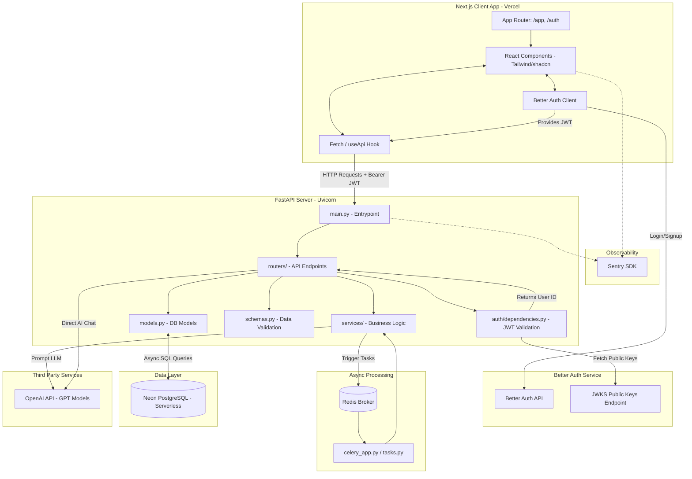

# GenZPocket System Design

GenZPocket is a modern, Gen-Z focused personal finance tracker. It uses a decoupled client-server architecture. The frontend is a Next.js (App Router) application hosted on Vercel, which communicates with a high-performance Python FastAPI backend via standard REST APIs.

## 🏗️ Architecture Diagram

## 🧩 Core Components & Codebase Mapping

### 1. Frontend: Next.js (React)
- **Tech**: Next.js 16 (App Router), React, Tailwind CSS, shadcn/ui.
- **Location**: `app/` and `components/` directories.
- **How it works**: 
  - **Routing**: The `app/(app)` directory contains protected routes like the dashboard and budgets, while `app/(auth)` contains the login pages.
  - **Data Fetching**: Custom hooks (like `useApi`) manage standard HTTP fetch calls to the backend, automatically injecting the Better Auth session token.
  - **Monitoring**: The app is instrumented with Sentry (`sentry.edge.config.ts`, `sentry.server.config.ts`) to catch client-side and edge errors.

### 2. Authentication: Better Auth
- **Tech**: Better Auth React Client.
- **Location**: Interacts with the backend `auth/` directory.
- **How it works**: Better Auth handles the actual identity provider flow (Google, Email OTP). It issues a JWT. The FastAPI backend never sees the raw passwords; it only receives the JWT in the `Authorization` header and cryptographically verifies it using public keys from Better Auth's JWKS endpoint (implemented in `backend/auth/dependencies.py`).

### 3. Backend API: FastAPI (Python)
- **Tech**: Python 3.14, FastAPI, Uvicorn, Pydantic.
- **Location**: `backend/` directory.
- **How it works**: 
  - **`main.py`**: The central application file that initializes FastAPI, CORS, and registers all routers.
  - **`routers/`**: Contains the controllers. E.g., `budgets.py`, `expenses.py`, `incomes.py`, `users.py`, and `ai.py`. These map to specific HTTP endpoints.
  - **`schemas.py`**: Pydantic classes that enforce strict type checking for incoming requests and outgoing JSON responses.
  - **`services/`**: Contains the heavy lifting and reusable business logic (e.g., `budget_alerts.py`).

### 4. Database: Neon PostgreSQL & SQLAlchemy
- **Tech**: Neon (Serverless Postgres), SQLAlchemy 2.0 (Async ORM), Alembic.
- **Location**: `backend/database.py`, `backend/models.py`, `backend/alembic/`.
- **How it works**: 
  - **`database.py`**: Configures the async connection pool to the Neon database.
  - **`models.py`**: Defines the actual database tables (Users, Expenses, Budgets, etc.) as Python classes.
  - **Alembic**: Manages database schema migrations (when you change a model, Alembic updates the actual database tables).

### 5. Background Tasks: Celery & Redis
- **Tech**: Celery, Redis.
- **Location**: `backend/celery_app.py`, `backend/tasks.py`.
- **How it works**: For operations that shouldn't block an HTTP response (like sending a budget alert email or generating a heavy monthly report), FastAPI hands a job to Redis. The Celery workers pick up the job from Redis and execute it in the background.

### 6. AI Engine: OpenAI
- **Tech**: OpenAI API (`AsyncOpenAI`).
- **Location**: `backend/routers/ai.py`.
- **How it works**: The backend securely holds the OpenAI API key. When a user asks the AI assistant a question on the frontend, the backend injects their recent financial context into a system prompt, queries the GPT model, and returns the response.

## 🔄 Data Flow Example: Checking Budget Status

1. **User Request**: The user navigates to the dashboard, and the React frontend calls `GET /api/backend/budgets/status`.
2. **Auth Verification**: The request hits `backend/main.py` which routes it to `backend/routers/budgets.py`. Before executing the route logic, `auth/dependencies.py` intercepts the JWT, checks its signature against the JWKS cache, and extracts the user's ID.
3. **Business Logic**: The router calls a function (potentially in `services/`) to calculate the budget status.
4. **Database Query**: SQLAlchemy (`database.py` & `models.py`) asynchronously queries the Neon Postgres database to sum up the user's expenses for the current month and compares it against their budget limit.
5. **Response**: The router serializes the result into JSON using `schemas.py` and sends it back to the Next.js frontend, which updates the UI.
